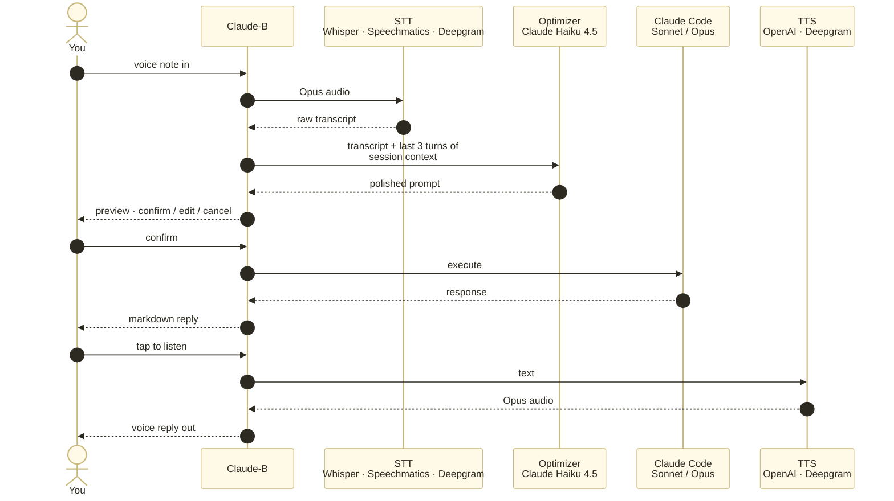

<p align="center">
  
</p>

# Claude-B

> Run Claude Code in the background. Send prompts, do other work, check results later.

Claude-B is a background-capable wrapper around [Claude Code](https://claude.ai/code) that enables:

- **Async workflows** - Send prompts, continue working, check results when ready
- **Session management** - Multiple concurrent AI sessions with conversation continuity
- **Fire-and-forget** - Launch background tasks, get notified when done
- **Notification inbox** - Interactive TUI to browse completed tasks with markdown rendering
- **Telegram integration** - Get notifications, voice input, TTS summaries, and reply to sessions from Telegram
- **Tmux bridge** - Notifications for live Claude Code sessions in tmux panes via Stop hook
- **Foreground attach** - Like `fg` in Linux, attach to see live output
- **Auto-watch streaming** - Automatically streams output after sending prompts
- **REST API** - Control sessions remotely via HTTP/WebSocket
- **Hooks** - Shell hooks and webhooks for notifications and automation
- **Multi-host orchestration** - Distribute work across multiple Claude-B instances

## The voice pipeline

Other Telegram/WhatsApp AI integrations forward your message to one model and
play the reply back. Claude-B chains **four specialised models** per
voice-to-voice round-trip — the middle step, prompt optimisation with fresh
session context, is what makes the difference between *"um, can you uh, fix
the thing we were just working on"* and an actionable prompt Claude Code can
actually execute.



Every stage is provider-swappable via `~/.claude-b/telegram.json`. Default
stack: Whisper → Claude Haiku 4.5 → your session's main model → OpenAI
`gpt-4o-mini-tts`. Confirm-before-execute is baked in, so a botched
transcription never becomes a rogue `rm -rf`.

## Installation

```bash
# One-line install (auto-detects npm or docker)
curl -fsSL https://cb.danielmoya.cv | bash

# Or via npm
npm i -g claude-b

# Or via Docker
docker run -d \
  -v ~/.claude-b:/root/.claude-b \
  --env-file ~/.claude-b/.env \
  ghcr.io/danimoya/claude-b:latest
```

Then configure everything interactively:

```bash
cb init
```

`cb init` walks you through BotFather, auto-captures your Telegram chat id,
and writes `~/.claude-b/.env`. Re-run it any time to update settings.

### Configuration

Claude-B reads from environment variables with this precedence:
**process env** > `~/.claude-b/.env` > `./.env`

| Variable | Required | Purpose |
|----------|----------|---------|
| `ANTHROPIC_API_KEY` | yes | Claude Code authentication |
| `TELEGRAM_BOT_TOKEN` | no | Enables Telegram remote control |
| `TELEGRAM_ALLOWED_CHAT_IDS` | no | Comma-separated chat ids allowed to use the bot |
| `OPENAI_API_KEY` | no | Whisper STT + TTS for voice notes |
| `SPEECHMATICS_API_KEY` / `DEEPGRAM_API_KEY` | no | Alternative STT providers |
| `CB_DATA_DIR` | no | Override `~/.claude-b` (useful in containers) |
| `CB_REST_HOST` / `CB_REST_PORT` | no | REST API bind address (defaults `127.0.0.1:3847`) |
| `CB_REST_API_KEY` | no | Pre-set REST API key (auto-generated otherwise) |

See `.env.example` for a starter template.

### Prerequisites

- Node.js 20+ (if installing via npm) or Docker
- [Claude Code](https://claude.ai/code) installed and configured

### From source

```bash
git clone https://github.com/danimoya/Claude-B.git
cd Claude-B
pnpm install && pnpm build && pnpm link --global
```

## Quick Start

```bash
# Send a prompt (creates session if needed)
cb "Explain this codebase"

# Check last result
cb -l

# Watch live output
cb -w

# List sessions
cb -s

# Attach to session (interactive mode)
cb -a main
```

## Commands

### Sessions & Prompts

| Command | Short | Description |
|---------|-------|-------------|
| `cb <prompt>` | | Send prompt to current session |
| `cb -- <prompt>` | | Explicit prompt (if starts with `-`) |
| `cb < file` | | Send file as prompt |
| `cb --last` | `-l` | Show last prompt result |
| `cb --sess` | `-s` | List all sessions |
| `cb --attach <id>` | `-a` | Attach to session (fg-style) |
| `cb --detach` | `-d` | Detach from session |
| `cb --new [name]` | `-n` | Create new session |
| `cb --model <model>` | `-m` | Claude model (with `--new`) |
| `cb --kill <id>` | `-k` | Terminate session |
| `cb --watch` | `-w` | Watch live output |
| `cb --select <id>` | `-x` | Select session for commands |
| `cb --current` | `-c` | Show current session |

### Fire-and-Forget & Inbox

| Command | Short | Description |
|---------|-------|-------------|
| `cb -f <prompt>` | | Launch task in background |
| `cb -f -g "goal" <prompt>` | | Fire-and-forget with goal description |
| `cb --inbox` | `-i` | Interactive notification inbox |
| `cb --inbox-count` | | Show unread notification count |
| `cb --inbox-clear` | | Mark all notifications as read |

### Telegram & Voice

| Command | Description |
|---------|-------------|
| `cb --telegram <token>` | Set up Telegram bot with token |
| `cb --telegram-status` | Show Telegram bot status |
| `cb --telegram-stop` | Disable Telegram notifications |
| `cb --voice-setup <provider> <key>` | Configure STT/TTS: `openai`, `speechmatics`, or `deepgram` |
| `cb --ai-provider <provider> <key>` | Configure AI prompt optimizer: `anthropic` or `openrouter` |
| `cb --voice-status` | Show voice pipeline status |

### REST API & Hooks

| Command | Short | Description |
|---------|-------|-------------|
| `cb --rest [port]` | `-r` | Start REST API server |
| `cb --rest-stop` | | Stop REST API server |
| `cb --api-key` | | Show REST API key |
| `cb --status` | | Daemon status and health |
| `cb --hook <event> <cmd>` | | Register shell hook |
| `cb --unhook <id>` | | Remove shell hook |
| `cb --hooks` | | List shell hooks |
| `cb --webhook <url>` | | Register webhook |
| `cb --unwebhook <id>` | | Remove webhook |
| `cb --webhooks` | | List webhooks |

### Multi-Host Orchestration

| Command | Description |
|---------|-------------|
| `cb --remote-add <url>` | Add remote host (with `--remote-key`) |
| `cb --remote-hosts` | List remote hosts |
| `cb --remote-health` | Health status of all hosts |
| `cb --remote <hostId> <prompt>` | Send prompt to remote host |
| `cb --remote-fire <hostId> <prompt>` | Fire-and-forget to remote host |
| `cb --remote-stats` | Orchestration statistics |

## Guides

### Quick Start: Fire-and-Forget

Launch tasks that run in the background and notify you when done:

```bash
# Fire a task
cb -f "Refactor the authentication module"

# Fire with a descriptive goal
cb -f -g "Add input validation to all API endpoints" "Review every route handler in src/routes/ and add zod validation"

# Check your inbox for results
cb -i
```

When tasks complete, you'll get a terminal bell notification. Use `cb -i` to browse results interactively.

### Quick Start: Interactive Inbox

The inbox (`cb -i`) is a full-screen TUI for browsing completed tasks:

```
── Inbox (1/3) * unread ──────────────────────────────

  OK  deploy-nginx  14:32  12.3s  $0.004
  Goal: Deploy nginx config and verify

  Configuration updated successfully.
  • nginx.conf validated
  • Service reloaded with zero downtime

  Resume: cb "your follow-up here"

── n=next  p=prev  r=read  d=delete  q=quit ──────────
```

**Keys:**
- `n` / `j` / `→` / `↓` — Next notification
- `p` / `k` / `←` / `↑` — Previous notification
- `r` — Mark current as read
- `d` — Delete current notification
- `q` / `Esc` / `Ctrl+C` — Quit

The inbox renders markdown output (headers, bold, code blocks, lists, quotes) and shows a resume command for continuing the conversation.

### Quick Start: Telegram Integration

Get notifications on your phone and reply to sessions from Telegram.

**Step 1: Create a Telegram bot**

1. Open Telegram and message [@BotFather](https://t.me/BotFather)
2. Send `/newbot`
3. Choose a name (e.g., "My Claude-B")
4. Choose a username (e.g., `my_claudeb_bot`)
5. Copy the token BotFather gives you (looks like `123456789:ABCdef...`)

**Step 2: Connect to Claude-B**

```bash
cb --telegram 123456789:ABCdefGHIjklMNO

# Output:
#   Telegram bot started!
#   Bot: @my_claudeb_bot
#   Send /start to your bot in Telegram to register.
```

**Step 3: Register in Telegram**

Open your bot in Telegram and send `/start`. You're now registered for notifications.

**Step 4: Use it**

```bash
# Fire a task — notification will arrive in Telegram
cb -f "Analyze the codebase for security issues"
```

When the task completes, you'll get a Telegram message like:

> ✅ **task-a1b2** completed (45.2s)
>
> ```
> Found 3 potential issues in auth module...
> ```
>
> Reply to this message to follow up, or /select a1b2 to switch sessions.

**Telegram commands:**
- `/start` — Register for notifications
- `/sessions` — List active sessions
- `/select <id>` — Select session for replies
- `/inbox` — Show inbox summary
- `/help` — Show all commands
- **Any text** — Send as prompt to selected session
- **Reply to notification** — Follow up on that specific session

**Manage Telegram:**
```bash
cb --telegram-status    # Check if running
cb --telegram-stop      # Disable and clear token
```

### Voice Pipeline Setup

Enable voice messages in Telegram: dictate prompts from your phone, get AI-optimized rewrites grounded in session context, and listen to audio summaries of completed tasks.

The voice pipeline has three components — **STT** (speech-to-text), **AI** (prompt optimizer), and **TTS** (text-to-speech). Each is configured independently.

**Step 1: Configure STT provider**

Choose one of three providers. The same provider handles both STT (transcription of your voice messages) and TTS (audio playback of results).

```bash
# OpenAI — Whisper STT + gpt-4o-mini-tts (recommended)
cb --voice-setup openai sk-proj-YOUR_OPENAI_KEY

# Speechmatics — enhanced accuracy, batch API
cb --voice-setup speechmatics YOUR_SPEECHMATICS_KEY

# Deepgram — Nova-3 STT + Aura TTS, no ffmpeg needed
cb --voice-setup deepgram YOUR_DEEPGRAM_KEY
```

**Step 2: Configure AI provider for prompt optimization**

When you send a voice message, the raw transcript is rewritten into a well-structured prompt by an AI model. This step uses a separate provider from STT/TTS.

```bash
# Anthropic Claude (recommended — best at prompt rewriting)
cb --ai-provider anthropic sk-ant-YOUR_ANTHROPIC_KEY

# OpenRouter (access to multiple models)
cb --ai-provider openrouter YOUR_OPENROUTER_KEY
```

**Step 3: Verify**

```bash
cb --voice-status

# Output:
#   Voice Pipeline:
#     STT Provider: openai
#     AI Provider: anthropic (default)
#     Pipeline: active
```

**Step 4: Use it**

In Telegram, send a voice message to the bot. You'll see:

1. `🎤 Transcribing...` — your audio is converted to text
2. `🎤 Transcribed. Optimizing prompt...` — the AI rewrites it using session context
3. A confirmation with the raw transcript and the optimized prompt:
   - **✅ Send** — submit the prompt to the selected session
   - **✏️ Edit** — type a corrected version manually
   - **❌ Cancel** — discard

After a session completes, each notification includes a **🔊 Listen** button that generates an audio summary using TTS.

**Customizing TTS model and voice**

The TTS model and voice are stored in `~/.claude-b/telegram.json` and can be changed without a code rebuild:

```bash
# Switch to a different model and voice
jq '.sttProvider.ttsModel = "tts-1" | .sttProvider.ttsVoice = "nova"' \
  ~/.claude-b/telegram.json > /tmp/tg.json && mv /tmp/tg.json ~/.claude-b/telegram.json

# Restart the daemon to apply
sudo systemctl restart cb-daemon.service   # if using systemd
# or: kill the daemon process and re-run cb to restart it
```

| Model | Price | Latency | Notes |
|-------|-------|---------|-------|
| `gpt-4o-mini-tts` | ~$12/1M chars | ~500ms | Newest, cheapest, supports tone instructions |
| `tts-1` | $15/1M chars | ~400ms | Fastest, battle-tested |
| `tts-1-hd` | $30/1M chars | ~800ms | Highest quality |

Available voices: `alloy`, `ash`, `ballad`, `coral`, `echo`, `fable`, `nova`, `onyx`, `sage`, `shimmer`, `verse`.

### Tmux Session Notifications

If you run Claude Code interactively in tmux panes, Claude-B can bridge those sessions to Telegram — get notified when any pane finishes a response, listen to audio summaries, select sessions, and reply from your phone.

This works alongside (not instead of) Claude-B's own session management. Your tmux panes keep running as-is; Claude-B just observes them.

**Prerequisites:**
- Telegram bot already configured (see above)
- REST API running (`cb -r`)
- tmux sessions with `claude` processes

**Step 1: Install the Stop hook**

Add this to `~/.claude/settings.json` (create it if it doesn't exist):

```json
{
  "hooks": {
    "Stop": [
      {
        "hooks": [
          {
            "type": "command",
            "command": "$HOME/Claude-B/bin/cb-notify.sh"
          }
        ]
      }
    ]
  }
}
```

The hook fires after every top-level Claude Code response. It reads the session transcript, extracts the last assistant text, and POSTs it to Claude-B's REST API.

> **Note:** Claude Code reads `settings.json` at startup. Panes that were already running won't pick up the hook until restarted. Either `/exit` + relaunch `claude` in each pane, or let them turn over naturally.

**Step 2: Start the REST API**

The hook script sends notifications to the REST API on `localhost:3847`:

```bash
cb -r 3847
```

If you use systemd, the `start-daemon.sh` script handles this automatically.

**Step 3: Use it from Telegram**

Once the hook is active:

- **Automatic notifications** — every time a tmux pane's Claude session finishes a response, you receive a Telegram message with the result text, duration, and a 🔊 Listen button.
- **`/sessions`** — shows all active tmux panes (with idle/busy status) alongside Claude-B's own sessions. Tap one to select it.
- **`/select`** — pick a tmux session by name or target (e.g. `/select general:2.0`).
- **Reply to a notification** — your text is typed directly into the originating tmux pane via `tmux send-keys`.
- **Voice messages** — dictate a prompt, get an AI-optimized rewrite grounded in the session's recent conversation history (last 3 turns), confirm, and it's typed into the pane.

**How it works under the hood:**

```
tmux pane (claude) ──Stop hook──> bin/cb-notify.sh
                                    │
                                    │ parses transcript JSONL
                                    │ resolves tmux target + title
                                    ▼
                              POST /api/notify
                                    │
                                    ▼
                              Claude-B daemon
                              ├── broadcastNotification → Telegram
                              ├── cache transcriptPath (for voice context)
                              └── persist to notification inbox
```

Reply path:
```
Telegram reply ──> bot.onPrompt("tmux:general:2.0", text)
                     │
                     ▼
                   daemon recognises tmux: prefix
                     │
                     ▼
                   tmux send-keys -t general:2.0 -l "text" Enter
```

**Troubleshooting:**

```bash
# Check if the hook is firing
tail -f ~/.claude-b/cb-notify.log

# Check REST API is reachable
curl http://127.0.0.1:3847/api/health

# Check Telegram bot is connected
cb --telegram-status

# Check voice pipeline
cb --voice-status
```

### Quick Start: Conversation Continuity

Sessions maintain conversation context across prompts — Claude remembers previous interactions:

```bash
# First prompt creates a conversation
cb "Explain the authentication flow in this codebase"

# Follow-up prompt continues the same conversation
cb "Now add rate limiting to the login endpoint"

# Claude remembers the auth flow discussion
cb "Add tests for what you just implemented"
```

### Quick Start: Multiple Sessions

```bash
# Create named sessions for different workstreams
cb -n backend
cb -n frontend

# Switch and work
cb -x backend
cb "Add rate limiting to API"

cb -x frontend
cb "Implement dark mode"

# Check all sessions
cb -s

# Watch a specific session's live output
cb -x backend
cb -w
```

### Quick Start: Hooks & Webhooks

```bash
# Get a desktop notification when any prompt completes
cb --hook "prompt.completed" "notify-send 'Claude-B' 'Task done'"

# Send a webhook to Slack on completion
cb --webhook "https://hooks.slack.com/services/T.../B.../xxx" --webhook-event "prompt.completed"

# List active hooks
cb --hooks
cb --webhooks
```

### Quick Start: REST API

```bash
# Start REST server
cb -r 3847

# Get API key
cb --api-key

# Use from any HTTP client
TOKEN=$(curl -s -X POST http://localhost:3847/api/auth/token \
  -H "Content-Type: application/json" \
  -d '{"api_key": "YOUR_KEY"}' | jq -r '.access_token')

curl http://localhost:3847/api/sessions -H "Authorization: Bearer $TOKEN"
```

### Quick Start: Multi-Host Orchestration

Distribute work across multiple servers running Claude-B:

```bash
# Each server needs REST API running
# On server1: cb -r
# On server2: cb -r

# From your local machine, add remote hosts
cb --remote-add http://server2:3847 --remote-key <api-key> --remote-name server2

# Send work to specific hosts
cb --remote server2 "Analyze the database schema"

# Or fire-and-forget to remote hosts
cb --remote-fire server2 "Run the full test suite"

# Monitor health
cb --remote-health
cb --remote-stats
```

### Piped Input

```bash
# Send file contents as prompt
cb < requirements.txt

# Pipe from other commands
echo "Fix the bug in auth.ts" | cb

# Combine with fire-and-forget
echo "Analyze this log for errors" | cb -f
```

## Architecture

```
┌──────────────┐    ┌────────────────┐
│   cb CLI     │    │  Telegram Bot  │
└──────┬───────┘    └───────┬────────┘
       │ Unix Socket        │
┌──────▼────────────────────▼──┐
│           Daemon             │
│                              │
│ ┌──────────┐  ┌───────────┐  │
│ │ Session  │  │   Hooks   │  │     ┌─────────────┐
│ │   Pool   │  │  Engine   │  │────▶│  Webhooks   │
│ └────┬─────┘  └───────────┘  │     └─────────────┘
│      │        ┌───────────┐  │
│      │        │  Inbox    │  │
│      │        └───────────┘  │     ┌─────────────┐
│      │        ┌───────────┐  │────▶│ Remote Host │
│      │        │  Orch.    │  │     │ Remote Host │
│      │        └───────────┘  │     └─────────────┘
│      │                       │
│ ┌────▼─────┐  ┌───────────┐  │
│ │  Claude  │  │ REST API  │◀─────── HTTP clients
│ │   Code   │  └───────────┘  │
│ └──────────┘                 │
└──────────────────────────────┘
```

### Components

- **CLI** (`cb`) - Thin client with interactive inbox TUI
- **Daemon** - Long-running process managing sessions, hooks, notifications, and integrations
- **Session** - Wraps Claude Code subprocess with conversation continuity
- **Notification Inbox** - JSONL-based store for completion notifications
- **Telegram Bot** - Sends notifications, receives prompts via Telegram
- **Hooks Engine** - Shell hooks and webhooks triggered by events
- **Orchestration** - Multi-host coordination with health checks and failover
- **REST API** - HTTP/WebSocket API for remote control
- **IPC** - Unix socket for local CLI-daemon communication

## Configuration

Config file: `~/.claude-b/config.json`

```json
{
  "sessions": {
    "maxConcurrent": 10,
    "defaultTimeout": 3600000
  },
  "notifications": {
    "shell": true,
    "command": "notify-send 'Claude-B' '$MESSAGE'"
  }
}
```

## Data Storage

```
~/.claude-b/
├── config.json              # Configuration
├── daemon.pid               # Daemon PID file
├── daemon.sock              # Unix socket
├── daemon.log               # Daemon logs
├── cb-notify.log            # Stop hook delivery log
├── api.key                  # REST API key (mode 600)
├── notifications.jsonl      # Notification inbox (append-only)
├── telegram.json            # Telegram bot config, session map, voice settings
├── sessions/
│   ├── index.json           # Session index
│   └── <session-id>/        # Per-session data
│       └── history.jsonl    # Prompt/response history
└── hooks.json               # Shell hooks & webhook definitions
```

## Docker

### Multi-Host Orchestration Testing

Run multiple Claude-B instances for testing orchestration features:

```bash
# Set your API key
export ANTHROPIC_API_KEY=your-key-here

# Start 3 instances
docker-compose up -d

# Instances available at:
#   host1: http://localhost:3847
#   host2: http://localhost:3848
#   host3: http://localhost:3849

# Configure orchestration from primary host
cb -r                                           # Start REST API
cb --remote-add http://localhost:3848 --remote-key <api-key> --remote-name host2
cb --remote-add http://localhost:3849 --remote-key <api-key> --remote-name host3

# Send prompts to remote hosts
cb --remote host2 "Analyze this codebase"
cb --remote-health                              # Check health status

# Stop containers
docker-compose down
```

### Single Instance

```bash
# Build image
docker build -t claude-b .

# Run container
docker run -d \
  -e ANTHROPIC_API_KEY=your-key \
  -p 3847:3847 \
  --name claude-b \
  claude-b
```

### Testing REST API and Hooks

Build and run a test container:

```bash
# Build the image
docker build -t claudeb-test:latest .

# Run container with API key
docker run -d \
  --name claudeb-test \
  -e ANTHROPIC_API_KEY=your-key-here \
  -p 3850:3847 \
  claudeb-test:latest

# Wait for startup and get API key from logs
sleep 3
docker logs claudeb-test
# Look for: API Key: cb_xxxxx...
```

Test the REST API:

```bash
# Set your API key (from docker logs output)
API_KEY="cb_your_api_key_here"

# Get JWT token
TOKEN=$(curl -4 -s -X POST http://127.0.0.1:3850/api/auth/token \
  -H "Content-Type: application/json" \
  -d "{\"api_key\": \"$API_KEY\"}" | jq -r '.access_token')

# Test health endpoint
curl -4 -s http://127.0.0.1:3850/api/health | jq

# List sessions
curl -4 -s http://127.0.0.1:3850/api/sessions \
  -H "Authorization: Bearer $TOKEN" | jq

# Create a session with model selection
curl -4 -s -X POST http://127.0.0.1:3850/api/sessions \
  -H "Authorization: Bearer $TOKEN" \
  -H "Content-Type: application/json" \
  -d '{"name": "test-session", "model": "sonnet"}' | jq

# Add a shell hook
curl -4 -s -X POST http://127.0.0.1:3850/api/hooks/shell \
  -H "Authorization: Bearer $TOKEN" \
  -H "Content-Type: application/json" \
  -d '{"event": "prompt.completed", "command": "echo Done!"}' | jq

# Add a webhook with session filter
curl -4 -s -X POST http://127.0.0.1:3850/api/hooks/webhook \
  -H "Authorization: Bearer $TOKEN" \
  -H "Content-Type: application/json" \
  -d '{"event": "session.created", "url": "https://httpbin.org/post", "sessionFilter": "test-session"}' | jq

# List all hooks
curl -4 -s http://127.0.0.1:3850/api/hooks/shell -H "Authorization: Bearer $TOKEN" | jq
curl -4 -s http://127.0.0.1:3850/api/hooks/webhook -H "Authorization: Bearer $TOKEN" | jq

# Cleanup
docker stop claudeb-test && docker rm claudeb-test
```

## Development

```bash
# Install dependencies
pnpm install

# Development mode (watch)
pnpm dev

# Build for production
pnpm build

# Type check
pnpm typecheck

# Run tests
pnpm test
```

## Potential Features

### Workflow Pipelines
Chain AI tasks together like GitHub Actions for AI. Define multi-step workflows where output flows between sessions.

```yaml
# .claude-b/workflows/code-review.yml
name: code-review
steps:
  - session: analyze
    prompt: "Analyze {{file}} for potential issues"
  - session: suggest
    prompt: "Based on: {{steps.analyze.output}}, suggest improvements"
  - session: implement
    prompt: "Implement the top suggestion"
    requires_approval: true
```

```bash
cb workflow run code-review --file src/api.ts
```

### Session Templates
Pre-configured session setups with custom system prompts, model selection, and hooks. One command to start specialized workflows.

```bash
# Create from template
cb -n myreview --template code-review

# Templates include: code-review, bug-fix, refactor, test-writer, docs
cb template list
cb template create my-custom --from current
```

### Prompt Queues & Scheduling
Queue prompts for batch processing. Schedule recurring AI tasks.

```bash
# Queue multiple prompts
cb queue add "Analyze auth.ts"
cb queue add "Analyze api.ts"
cb queue add "Summarize all findings"
cb queue run                    # Process sequentially

# Schedule recurring tasks
cb schedule "Review open PRs" --cron "0 9 * * *"
cb schedule "Update docs" --every 24h
```

### Cross-Session Context
Sessions that share context and reference each other's outputs.

```bash
# Create a context pool
cb context create myproject

# Sessions share the pool
cb -n backend --context myproject
cb -n frontend --context myproject

# Reference other sessions
cb -x frontend "Use the API schema from @backend to generate TypeScript types"
```

### Cost & Usage Analytics
Track token usage, set budgets, and monitor spending.

```bash
cb usage                        # Current session stats
cb usage --all                  # All sessions
cb usage --report weekly        # Usage report

cb budget set 10.00 --daily     # Daily spending limit
cb budget set 100.00 --session  # Per-session limit
```

### Session Snapshots & Branching
Git-like version control for AI sessions. Save state, branch, compare approaches.

```bash
cb snapshot create "before-refactor"
cb snapshot list
cb snapshot restore abc123

# Branch a session
cb branch myfeature --from main-session
cb branch compare main-session myfeature
```

### Smart Fallbacks & Retries
Automatic retry on failures with model fallback chains.

```bash
# Configure fallback chain
cb config set fallback-chain "opus,sonnet,haiku"

# Auto-retry with exponential backoff
cb config set auto-retry true
cb config set max-retries 3
```

### Output Transformers
Post-process AI output with built-in or custom transformers.

```bash
# Extract code blocks
cb "Generate a function" | cb transform extract-code

# Parse structured output
cb "List files as JSON" | cb transform json

# Custom transformer
cb transform register my-parser --script ./parse.js
```

## License

AGPL-3.0 - See [LICENSE](LICENSE) for details.
